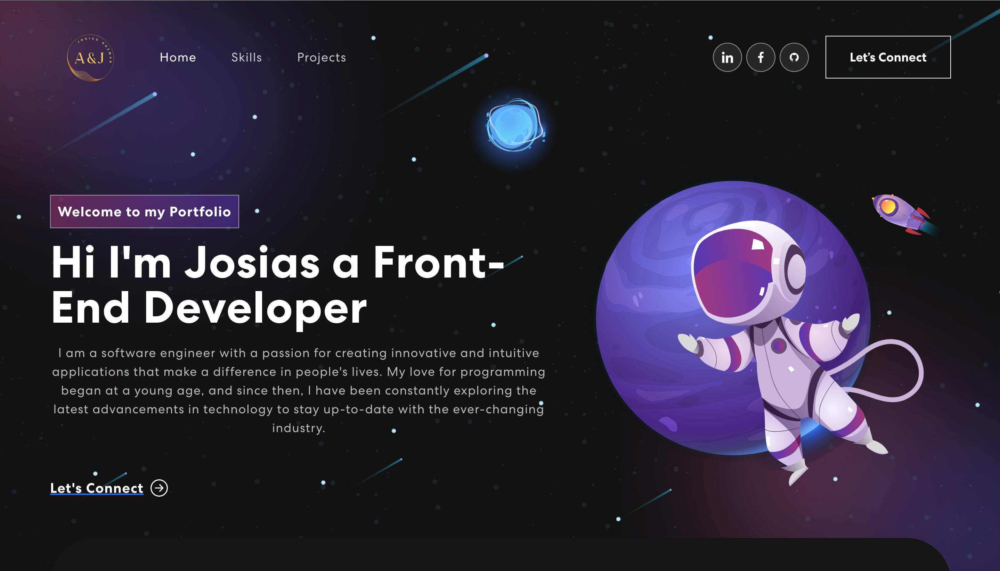

#### About Me:
I like learning new things. 
My favorite language is JavaScript. My favorite Framework is React. I enjoy building large applications. 
On my days off, I enjoy learning how to solve problems, playing video games and getting better at playing the piano. 
Connect with me on [LinkedIn](http://linkedin.com/in/josiasguzman). I am open to new opportunities in the tech industry! 

#### I am:
* 🤔 Interested in working in Front End Development|Software Engineering. 
* 🔭 Currently working on my problem solving skills. 
* 🌱 I like to strengthened my skills... 

#### Programming Langauges:

#### Frameworks/Libraries:

#### Databases:

#### Additional Tools:

- 📫 How to reach me: josiasg352@gmail.com

